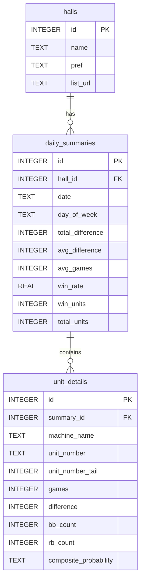

# 設計書 (anaslo-scraper-ja)

本設計書では、要件定義書に基づき、アナスロから店舗データを収集して分析するシステムのデータフロー、データベース設計、および実装するファイル構成を定義します。

---

## 1. システム構成とデータフロー

### システム構成図
```mermaid
graph TD
    A[run.py (メイン起動スクリプト)] -->|1. データ収集開始| B(scraper.py)
    A -->|2. ダッシュボード起動| C(app.py - Streamlit)
    
    B -->|アナスロへリクエスト| D[アナスロ Webサイト]
    D -->|HTML取得| B
    
    B -->|データ書き込み| E[(db.py - SQLite)]
    C -->|データ読み込み/集計| E
```

### データフローと非機能設計
1.  **起動・バックアップ (`run.py` / `db.py`)**:
    *   システム起動時に、`db.py` 内のバックアップ処理が走り、`anaslo_data.db` を `backup/anaslo_data_YYYYMMDD_HHMMSS.db` としてコピーします。直近5世代のみを保持し、古いものは自動削除します。
2.  **データ収集 (`scraper.py`)**:
    *   `config.json` から対象店舗の情報を読み込みます。
    *   クローラーは以下の3つのモードで実行できます。
        *   **通常モード**: 最新の未登録データのみを自動取得。
        *   **バックフィルモード**: 引数で指定された日数（例: 30日分）を遡って取得。
        *   **リフレッシュモード**: 指定された日付のデータを一度DBから削除し、再取得。
    *   リクエスト間には `time.sleep(random.uniform(3, 5))` を挿入し、User-Agentには一般的なブラウザのヘッダーを設定します。
    *   HTTPエラーやタイムアウト（15秒）が発生した場合は、10秒待機して最大3回リトライします。
3.  **データ分析 (`app.py`)**:
    *   SQLiteの読込時は同時書き込みと競合しないよう、`sqlite3.connect('anaslo_data.db', timeout=20.0)` を指定しロックを回避します。
    *   Streamlit上で各種集計（曜日、日付末尾、台番号末尾、イベント日）を実行し、グラフを描画します。

---

## 2. データベース設計 (SQLite)

SQLiteデータベース `anaslo_data.db` には、以下の3つのテーブルを作成します。



### インデックス設計
検索および集計の高速化のため、以下のインデックスを作成します。
*   `idx_daily_summaries_date`: 日付によるフィルタリング用。
*   `idx_unit_details_machine`: 機種名による集計用。
*   `idx_unit_details_tail`: 台番号末尾による集計用。

---

## 3. ファイル構造プラン

開発するシステムは、本プロジェクトのルート配下に独立したPythonツールとして作成します。
配置場所: `tools/anaslo-scraper/` （新規作成）

```
tools/anaslo-scraper/
├── config.json         # 店舗URLなどの設定ファイル
├── requirements.txt    # 必要なPythonライブラリ（requests, streamlit等）の定義
├── db.py               # SQLiteのテーブル作成・接続・読み書きヘルパー
├── scraper.py          # アナスロのクローリングおよびHTMLパース処理
├── app.py              # StreamlitダッシュボードのUIおよび集計ロジック
└── run.py              # 収集とダッシュボードの起動を一括で行うメインスクリプト
```

### 各ファイルの役割詳細

#### 1. `config.json`
クローリング対象の店舗名、都道府県、データ一覧URLなどを定義します。
```json
{
  "halls": [
    {
      "name": "大盛空港通り店",
      "pref": "愛媛県",
      "list_url": "https://ana-slo.com/%e3%83%9b%e3%83%bc%e3%83%ab%e3%83%87%e3%83%bc%e3%82%bf/%e6%84%9b%e5%aa%9b%e7%9c%8c/%e5%a4%a7%e7%9b%9b%e7%a9%ba%e6%b8%af%e9%80%9a%e3%82%8a%e5%ba%97-%e3%83%87%e3%83%bc%e3%82%bf%e4%b8%80%e8%a6%a7/"
    }
  ]
}
```

#### 2. `db.py`
*   `sqlite3` 標準ライブラリを使用。
*   起動時の自動バックアップローテーション処理（`backup/` ディレクトリ作成、最大5世代管理）。
*   データベースファイル `anaslo_data.db` が存在しない場合、自動的にテーブルとインデックスを作成する関数。
*   接続時に `sqlite3.connect('anaslo_data.db', timeout=20.0)` を使用し、排他制御を考慮。
*   データ挿入関数（`save_daily_data`）：サマリーと詳細データをトランザクションでバルクインサート。
*   リフレッシュ用データ削除関数（`delete_daily_data`）：特定の日付のサマリーと詳細データを削除。

#### 3. `scraper.py`
*   `requests` を使用してHTMLを取得。
*   `BeautifulSoup` を使って、以下の要素をパースします：
    *   **日付**: 記事タイトル（例:「2026/06/06 大盛空港通り店 データまとめ」）から `2026-06-06` などを抽出。
    *   **全体サマリー**: `class="total_get_medals_table"` などのテーブルから「総差枚」「平均差枚」「勝率」「総台数」「勝ち台数」を取得（パチンコデータはスキップ）。
    *   **台別詳細**: `id="all_data_table"`（全データ一覧テーブル）の `<tbody>` 内の各行から「機種名」「台番号」「ゲーム数」「差枚」「BB」「RB」などを取得。台番号から末尾1桁を `int(台番号[-1])` で算出。
*   クローラーのエントリー関数：
    *   `crawl_latest()`: 未登録日を自動収集。
    *   `crawl_backfill(days)`: 指定した日数分の過去ログを遡り収集。
    *   `crawl_refresh(date)`: 指定日のデータを削除して再取得。

#### 4. `app.py` (Streamlit)
*   サイドバーで「店舗選択」「期間（日付）選択」「機種名選択（部分一致検索対応）」を行えるようにします。
*   以下のグラフや表を配置します：
    *   **店舗全体KPI**: 選択期間の平均差枚、平均勝率、最大差枚など。
    *   **曜日別分析**: 棒グラフ（X軸: 曜日、Y軸: 平均差枚および勝率）。
    *   **日付末尾別分析**: 棒グラフ（X軸: 末尾0〜9、Y軸: 平均差枚および勝率）。
    *   **台末尾別分析**: 棒グラフ（X軸: 台番号末尾0〜9、Y軸: 平均差枚）。
    *   **特定日（7のつく日・ゾロ目の日）の分析**: イベント日と通常日の平均差枚数の比較棒グラフ。
    *   **機種ランキング**: テーブル（平均差枚順にソート）。

#### 5. `run.py`
*   ユーザーがコマンドプロンプトやPowerShellから実行するエントリーポイント。
*   コマンドライン引数を解析し、対話メニューを使わずに直接動作させることも可能とします：
    *   `python run.py --collect`: 最新の未登録データの収集を実行
    *   `python run.py --backfill <days>`: 過去の指定日数分のバックフィルを実行
    *   `python run.py --refresh <YYYY-MM-DD>`: 指定日データの上書き収集を実行
    *   `python run.py --dashboard`: Streamlitダッシュボードを起動
    *   引数なしで実行された場合のみ、対話式メニューを表示。
*   実行時に `logs/` ディレクトリを作成し、ログ設定を初期化します。
